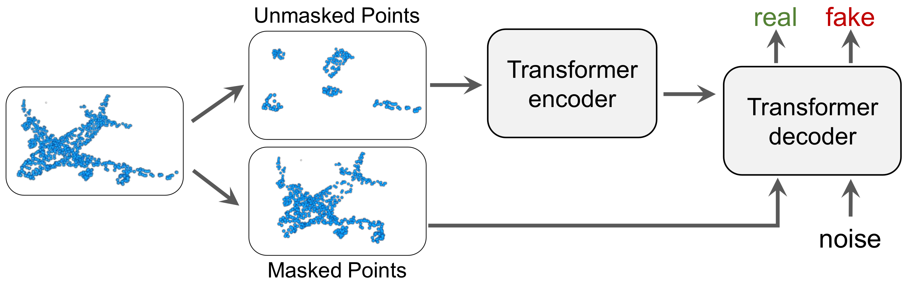

# MaskPoint

## [ECCV 2022] Masked Discrimination for Self-Supervised Learning on Point Clouds

[Haotian Liu](https://hliu.cc), [Mu Cai](https://sites.google.com/view/mucai), [Yong Jae Lee](https://pages.cs.wisc.edu/~yongjaelee/)

Please check out our paper [here](https://arxiv.org/abs/2203.11183).

<div align="center">
  
</div>

## Pretrained Models

|  Task | Dataset | Config | Acc.| Download|
|  ----- | ----- |-----|  -----| -----|
|  Pre-training | ShapeNet |[pretrain_shapenet.yaml](./cfgs/pretrain_shapenet.yaml)| -- | {[w/o](https://static.hliu.cc/files/projects/maskpoint/checkpoints/pretrain_shapenet.pth),[w/](https://static.hliu.cc/files/projects/maskpoint/checkpoints/pretrain_shapenet_moco.pth)} MoCo |
|  Classification | ScanObjectNN |[finetune_scanobject_hardest.yaml](./cfgs/finetune_scanobject_hardest.yaml)| 84.6%| [here](https://static.hliu.cc/files/projects/maskpoint/checkpoints/finetune_scanobject_hardest.pth)  |
|  Classification | ScanObjectNN |[finetune_scanobject_objectbg.yaml](./cfgs/finetune_scanobject_objectbg.yaml)|89.3% | [here](https://static.hliu.cc/files/projects/maskpoint/checkpoints/finetune_scanobject_objectbg.pth) |
|  Classification | ScanObjectNN |[finetune_scanobject_objectonly.yaml](./cfgs/finetune_scanobject_objectonly.yaml)| 89.7%| [here](https://static.hliu.cc/files/projects/maskpoint/checkpoints/finetune_scanobject_objectonly.pth) |
|  Classification | ModelNet40 |[finetune_modelnet.yaml](./cfgs/finetune_modelnet.yaml)| 93.8%| [here](https://static.hliu.cc/files/projects/maskpoint/checkpoints/finetune_modelnet.pth) |

### 3D Object Detection

|  Task | Dataset | Config | AP25 | AP50 | Download|
|  ----- | ----- |-----|  -----|  -----| -----|
|  Pre-training | ScanNet-Medium |[pretrain_scannet_enc3x.yaml](./cfgs/pretrain_scannet_enc3x.yaml)| -- | -- | [here](https://static.hliu.cc/files/projects/maskpoint/checkpoints/pretrain_scannet_medium_enc3x.pth) |
|  Pre-training | ScanNet-Medium |[pretrain_scannet_enc12x.yaml](./cfgs/pretrain_scannet_enc12x.yaml)| -- | -- | [here](https://static.hliu.cc/files/projects/maskpoint/checkpoints/pretrain_scannet_medium_enc12x.pth) |
|  Detection | ScanNetV2 |[finetune_scannetv2_enc3x.sh](https://github.com/mu-cai/3detr_MaskPoint/blob/main/train_enc3x.sh)| 63.4 | 40.6 | [here](https://static.hliu.cc/files/projects/maskpoint/checkpoints/finetune_scannetv2_enc3x.pth) |
|  Detection | ScanNetV2 |[finetune_scannetv2_enc12x.sh](https://github.com/mu-cai/3detr_MaskPoint/blob/main/train_enc12x.sh)| 64.2 | 42.1 | [here](https://static.hliu.cc/files/projects/maskpoint/checkpoints/finetune_scannetv2_enc12x.pth) |


## Usage

### Requirements

- PyTorch >= 1.7.0
- python >= 3.7
- CUDA >= 9.0
- GCC >= 4.9 
- torchvision

```
pip install -r requirements.txt
bash install.sh
```

### Dataset

For **ModelNet40**, **ScanObjectNN**, and **ShapeNetPart** datasets, we use **ShapeNet** for the pre-training of MaskPoint models, and then finetune on these datasets respectively.

For **ScanNetV2** object detection dataset, we use **ScanNet-Medium** for the pre-training.  Please refer to the paper Sec. 4 [Pretraining Datasets] for details.

The details of used datasets can be found in [DATASET.md](./DATASET.md).


### MaskPoint pre-training
To pre-train the MaskPoint models on ShapeNet, simply run:
```
python main.py --config cfgs/pretrain_shapenet.yaml \
    --exp_name pretrain_shapenet \
    [--val_freq 10]
```
*val_freq* controls the frequence to evaluate the Transformer on ModelNet40 with LinearSVM.

Similarly, to pre-train the MaskPoint models on ScanNet-Medium, simply run:
```
# Pretrain 3x encoder model
python main.py --config cfgs/pretrain_scannet_enc3x.yaml \
    --exp_name pretrain_scannet_enc3x \
    [--val_freq 10]

# Pretrain 12x encoder model
python main.py --config cfgs/pretrain_scannet_enc12x.yaml \
    --exp_name pretrain_scannet_enc12x \
    [--val_freq 10]
```

### Fine-tuning on downstream tasks
We finetune our MaskPoint on 5 downstream tasks: Classfication on ModelNet40, Few-shot learning on ModelNet40, Transfer learning on ScanObjectNN, Part segmentation on ShapeNetPart, and Object detection on ScanNetV2.

#### ModelNet40
To finetune a pre-trained MaskPoint model on ModelNet40, simply run:
```
python main.py
    --config cfgs/finetune_modelnet.yaml \
    --finetune_model \
    --ckpts <path> \
    --exp_name <name>
```

To evaluate a model finetuned on ModelNet40, simply run:
```
bash ./scripts/test.sh <GPU_IDS>\
    --config cfgs/finetune_modelnet.yaml \
    --ckpts <path> \
    --exp_name <name>
```

#### Few-shot Learning on ModelNet40
We follow the few-shot setting in the previous work.

First, generate your own few-shot learning split or use the same split as us (see [DATASET.md](./DATASET.md)).
```
# generate few-shot learning split
cd datasets/
python generate_few_shot_data.py
# train and evaluate the MaskPoint
python main.py \
    --config cfgs/fewshot_modelnet.yaml \
    --finetune_model \
    --ckpts <path> \
    --exp_name <name> \
    --way <int> \
    --shot <int> \
    --fold <int>
```

#### ScanObjectNN
To finetune a pre-trained MaskPoint model on ScanObjectNN, simply run:
```
python main.py \
    --config cfgs/finetune_scanobject_hardest.yaml \
    --finetune_model \
    --ckpts <path> \
    --exp_name <name>
```

To evaluate a model on ScanObjectNN, simply run:
```
bash ./scripts/test_scan.sh <GPU_IDS>\
    --config cfgs/finetune_scanobject_hardest.yaml \
    --ckpts <path> \
    --exp_name <name>
```

#### ScanNetV2
See [MaskPoint -- 3DETR Finetuning](https://github.com/mu-cai/3detr_MaskPoint) for detailed instructions.

#### ShapeNetPart
Coming soon..

## Citation
```
@article{liu2022masked,
  title={Masked Discrimination for Self-Supervised Learning on Point Clouds},
  author={Liu, Haotian and Cai, Mu and Lee, Yong Jae},
  journal={Proceedings of the European Conference on Computer Vision (ECCV)},
  year={2022}
}
```
